 # Firebase Security Tests

Repositorio para demostración/capacitación de seguridad en proyectos de Firebase

## Introducción
Tenemos tres secciones, para ejemplificar operaciones de lectura y escritura a la base de datos y storage.

### User Profile (Realtime Database / Información privada)
Sección en la que tenemos la información del usuario. Esto es información que debería de ser privada **nadie más que el usuario debería de poder leer**, y tenemos campos que tal vez **sólo debería de poder cambiar un administrador**.

### Lista de tiendas (Realtime Database / Información de lectura pública)
En la situación por ejemplo de una tienda departamental con presencia online, tendríamos registradas las ubicaciones de las sucursales para poner en un mapa.

En este caso la información debe de ser de lectura pública, pero escritura prohibida o restringida para que solo los administradores puedan cambiarla.

### Logotipo de la aplicación (Storage)
El logo de la app, que es un archivo alojado en Firebase storage, debería de poderse leer para poner en la app... pero nadie debería de poder cambiar ese archivo, porque cambiaría el logo de la app para todos los usuarios.

**Realtime DB preview**
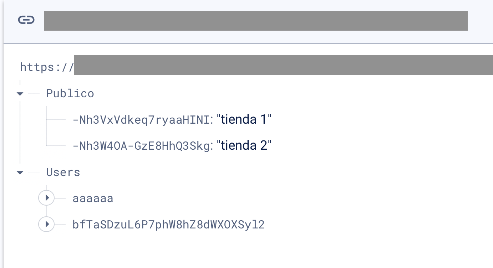

[Contenido completo de base de datos de prueba](./docs/rtdb_data.json)

**Storage preview**
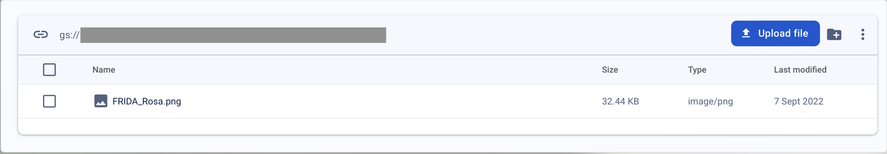

## Ejercicios de Seguridad
Por la naturaleza de las `firebase keys`, son públicas y podemos verlas en el código fuente de la web app

Las llaves de firebase se pueden sacar con las `Chrome Dev Tools` 
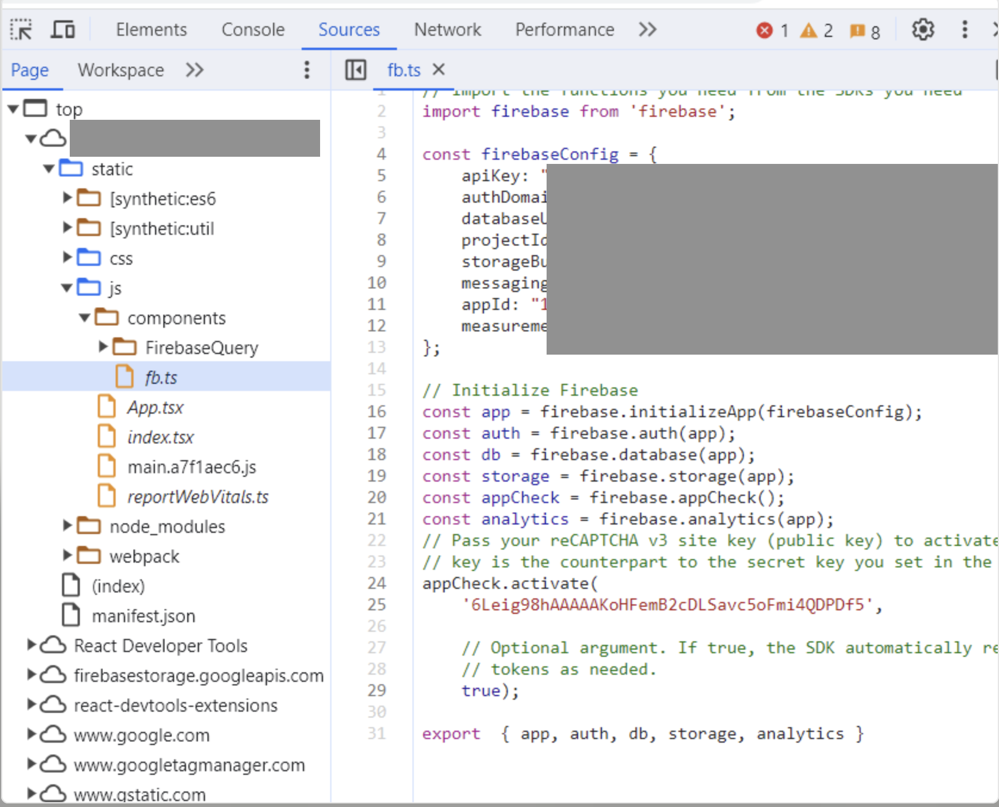

pueden verse algo así
```ts
const firebaseConfig = {
    apiKey: "xxxxx",
    authDomain: "xxxxx",
    databaseURL: "xxxxx",
    projectId: "xxxxx",
    storageBucket: "xxxxx",
    messagingSenderId: "xxxxx",
    appId: "xxxxx",
    measurementId: "xxxxx"
};
```

Reglas de seguridad iniciales
```json
{
  "rules": {
    ".read": true,
    ".write": true
  }
}
```

En primer lugar, las reglas en raíz no deberían de ser true en _root_
```json
{
  "rules": {
    ".read": false,
    ".write": false
  }
}
```

### Acceso a información privada
Explotando una vulnerabilidad en la [Información de perfil de usuario](#user-profile). Leeremos la información privada de los usuarios

[001_acceso_info_privada.js](./ejercicios/001_acceso_info_privada.js)

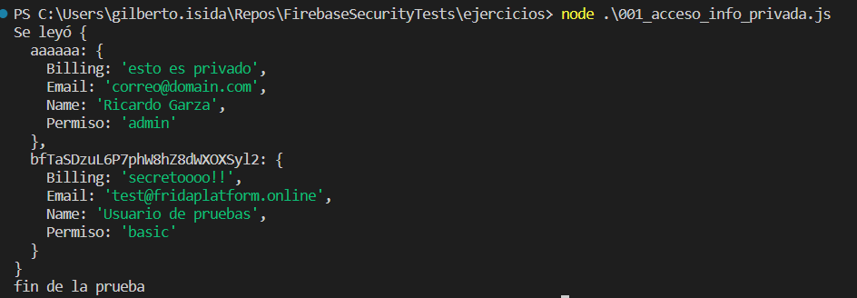

> Fix: Configurar una regla en el nodo `Users`, que requiera sesión iniciada
```json
{
  "rules": {
    ".read": false,
    ".write": false,
    "Users": {
        ".read": "auth.uid != null",
        ".write": "auth.uid != null"
    }
  }
}
```
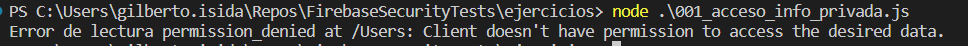

**Problema adicional**: se puede [00_crear_usuario.js](./ejercicios/000_crear_usuario.js) y entonces, vuelve a estar vigente el issue [001_acceso_info_privada.js](./ejercicios/001_acceso_info_privada.js)

> Fix: Configurar una regla en el nodo `Users`, que limite el permiso a solo el nodo propio del usuario basado en el UID
```json
{
  "rules": {
    ".read": false,
    ".write": false,
    "Users":{
      "$uid": {
      	".read": "auth.uid == $uid",
        ".write": "auth.uid == $uid"
      }
    }
  }
}
```
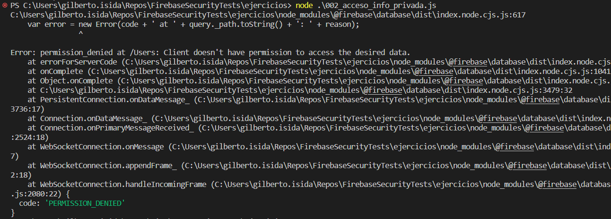

**Problema adicional**: Aún así, apuntando al nodo específico de nuestro usuario, podríamos cambiar el nivel de permisos a uno más poderoso `privilege escalation attack involves an increase of privileged access beyond what a user, application, or other asset already has. This entails moving from a low level of privileged access to a higher level of privileged access`

[003_privilege_escalation.js](./ejercicios/003_privilege_escalation.js)

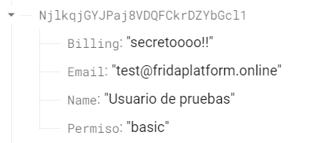
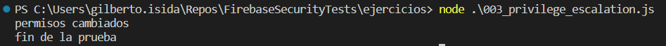
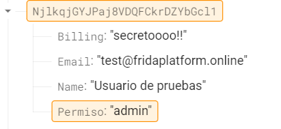

> Fix: Validar el request previo a aplicar el cambio
```json
{
  "rules": {
    ".read": false,
    ".write": false,
    "Users":{
      "$uid": {
      	".read": "auth.uid == $uid",
        ".write": "auth.uid == $uid",
        ".validate": "root.child('Users/' + $uid + 'Permiso').val() == newData.child('Permiso').val()"
      }
    }
  }
}
```
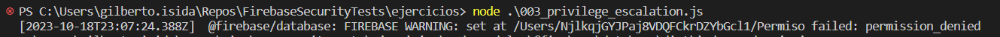

### Acceso a información de solo lectura
Ahora, intentemos establecer la regla para el nodo de las tiendas. Lo que necesitamos aquí es que se pueda leer pero no escribir.

**Bonus**: Los admins sí pueden escribir en este nodo

#### Solución
```json
{
  "rules": {
    ".read": false,
    ".write": false,
    "Users":{
      "$uid": {
      	".read": "auth.uid == $uid",
        ".write": "auth.uid == $uid",
        ".validate": "data.child('Permiso').val() == newData.child('Permiso').val()"
      }
    },
    "Publico": {
      ".read": true,
      //opcion 0: no permitir escritura
      ".write": false,
      //opcion 1: consulta al user
      ".write": "root.child('Users').child(auth.uid).child('Permiso').val() == 'admin'",
      //opcion 2: custom claims
      ".write": "auth.token.admin == true"
    }
  }
}
```
[Referencia de Custom Claims](https://firebase.google.com/docs/auth/admin/custom-claims#set_and_validate_custom_user_claims_via_the_admin_sdk)

### Acceso a firestore y storage
Las reglas de firestore y storage tienen una sintaxis algo diferente.

#### Firestore
En una colección de usuarios, donde los usuarios tienen una estructura así
```ts
interface AdminUser {
    Disabled: boolean
    Email: string
    Name: string
    Roles: string[]
    UID: string
}
```
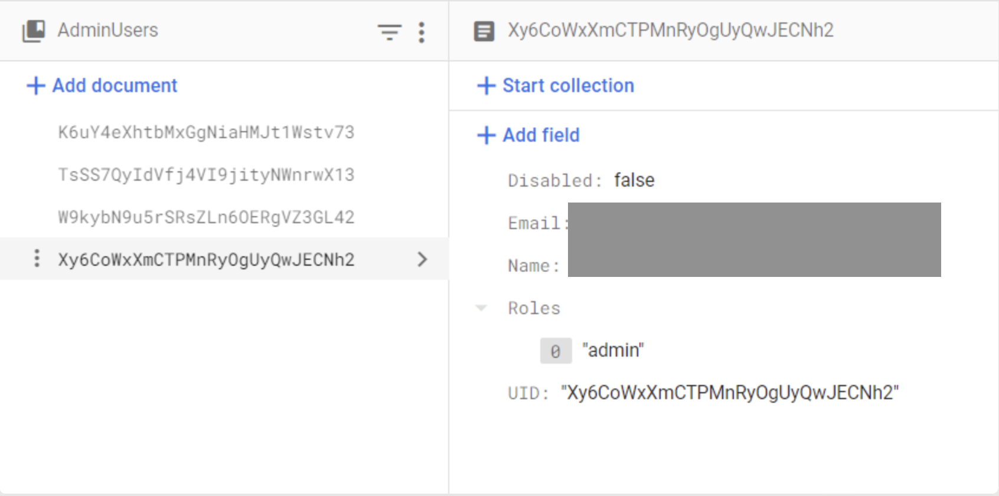

##### Funciones reutilizables
Tanto para mejorar legibilidad, como para reutilizar ciertas condiciones en varias colecciones o permisos, se pueden hacer funciones que firestore evaluará en _runtime_. Debemos hacerlas con parámetros y con consultas a más recursos de la BD.

```
//true si la operación no trae nada que altere el valor de alguno de los campos dados
function willNotChange(fields) {
    return !request.resource.data
            .diff(resource.data)
            .affectedKeys()
            .hasAny(fields)
}
```

##### Permisos
- `read`
- `write`: Engloba tres permisos en uno, para no especificar los tres.
    - `create`: Crear documentos nuevos
    - `update`: Escribir sobre documentos existentes
    - `delete`: Borrar el documento entero, con todos sus campos

##### Ejemplo de reglas
```
rules_version = '2';

service cloud.firestore {
  match /databases/{database}/documents {
    //***************FUNCIONES REUTILIZABLES
    function isAdmin() {
        return isLogged() && 
        "admin" in get(/databases/$(database)/documents/AdminUsers/$(request.auth.uid)).data.Roles;
    }

    function willNotChange(fields) {
        return !request.resource.data
                .diff(resource.data)
                .affectedKeys()
                .hasAny(fields)
    }

    //Colección de usuarios administradores, solo los administradores pueden crear y actualizar
    match /AdminUsers/{$uid} {
    	allow read: if request.auth.uid == $uid;
        allow update: if isAdmin();
    }

    //Colección de usuarios
    match /Users/{$uid} {
    	allow read: if 
      //Es el mismo usuario
      request.auth.uid == $uid;
      
      //Se permite el cambio de información del usuario EXCEPTO su rango
      allow update: if request.auth.uid == $uid &&
      								willNotChange(["Roles"])
    }
```

#### Storage
```
rules_version = '2';
service firebase.storage {
  match /b/{bucket}/o {
    //Permisos sobre root y todos sus hijos, bloquear todo
    match /{allPaths=**} {
      allow read, write: if false;
    }

    //Permisos sobre una carpeta privada, usamos el uid del request token
    match /Users/{$uid}/{allPaths=**} {
    	allow read: if request.auth.uid == $uid
    }
    
    //Permisos específicos sobre un archivo que está en root
    match /FRIDA_Rosa.png {
    	allow read;
    }
  }
}
```

### Rules Playground
Mientras estemos escribiendo las reglas, para no afectar realmente producción, podemos usar esta herramienta.

Nos permite simular operaciones de read, create, update, delete
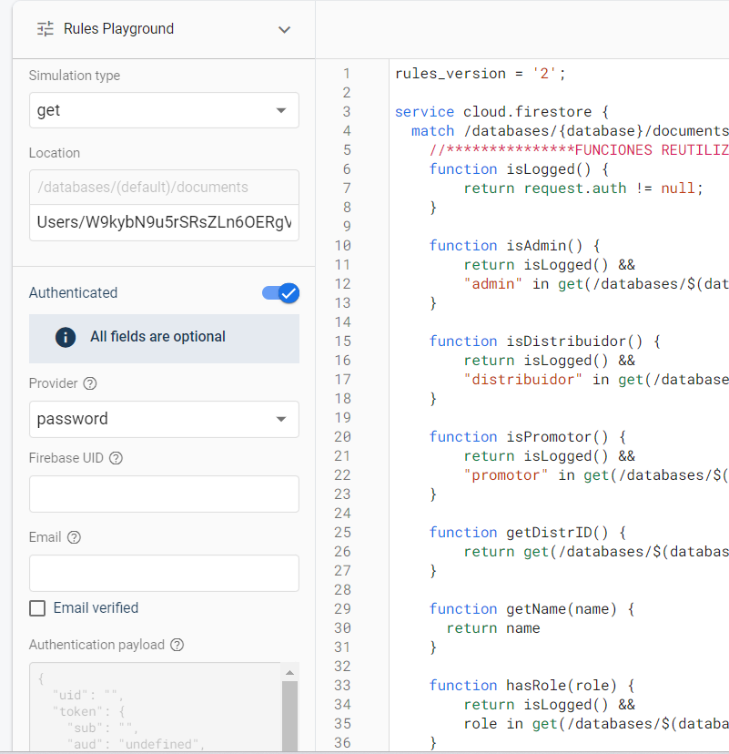
